# Workflow diagrams

Mermaid renders on GitHub, in Obsidian, and on the docs site.

## Contents

- [From first message to a working company](#from-first-message-to-a-working-company)
- [The four routes, side by side](#the-four-routes-side-by-side)
- [Two seats of Team Advisor](#two-seats-of-mops)
- [One feature through the conveyor](#one-feature-through-the-conveyor)
- [Escalation & control](#escalation-control)
- [Session limits — detect and recover](#session-limits-detect-and-recover)
- [Getting current — what /upgrade actually walks](#getting-current-what-upgrade-actually-walks)
- [Something went wrong — whose defect is it?](#something-went-wrong-whose-defect-is-it)
- [The skill lifecycle — gates, not ceremony](#the-skill-lifecycle-gates-not-ceremony)
- [A catch climbs, and a contradiction stops](#a-catch-climbs-and-a-contradiction-stops)

## From first message to a working company

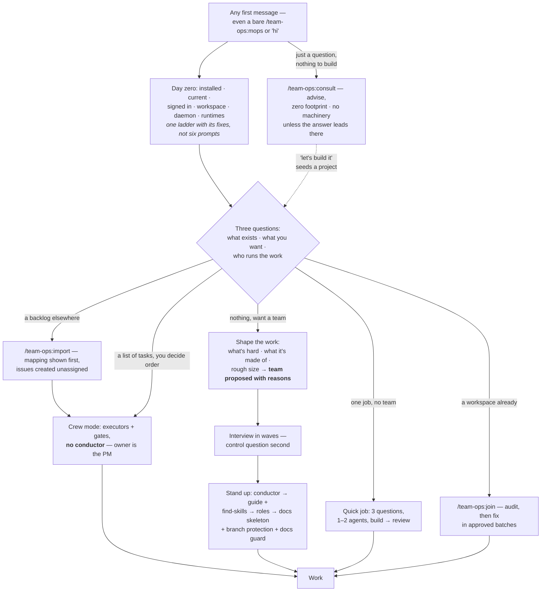

> Nobody is asked to choose a command. Crew mode is the **default offer after `/team-ops:import`
> when no conductor is standing** — someone who just moved their backlog has already decided
> what the work is; a workspace that already has a conductor keeps it. Adding a conductor
> later is an upgrade, not a redo.

## The four routes, side by side

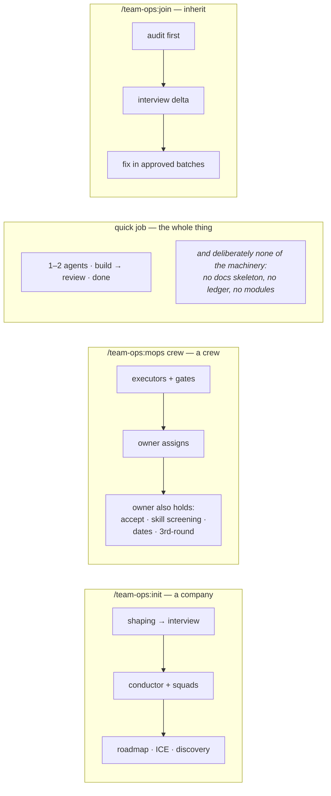

## Two seats of Team Advisor

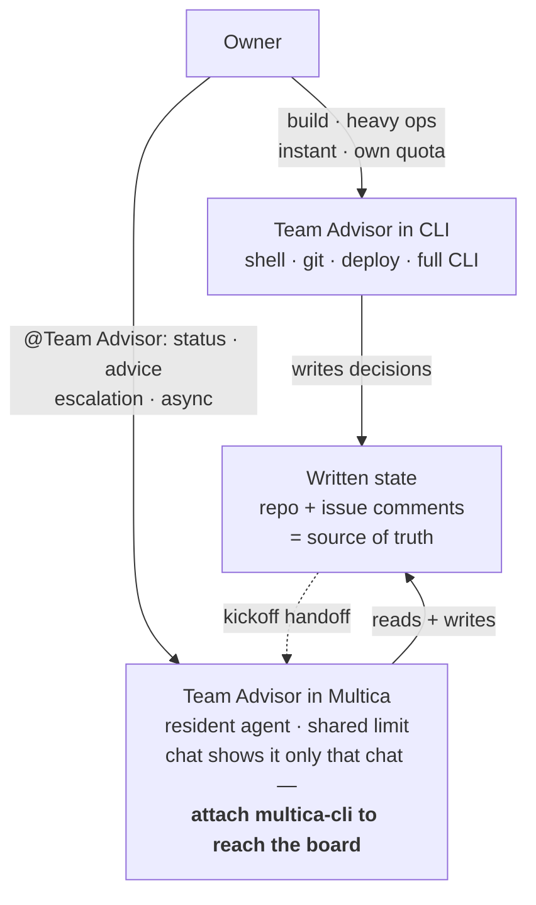

## One feature through the conveyor

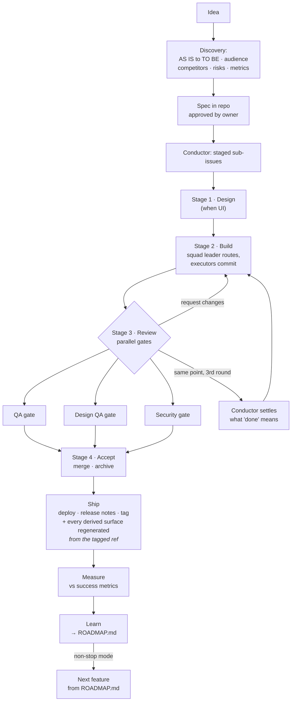

> A stage is a **barrier, not a queue**: everything genuinely independent goes on the *same*
> stage and runs concurrently — the numbers order dependencies, not tasks. And width is only
> real on a `github_repo` project; a `local_directory` serializes everything regardless.

## Escalation & control

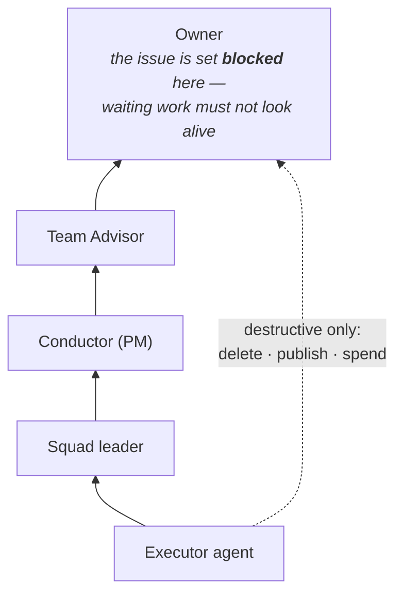

## Session limits — detect and recover

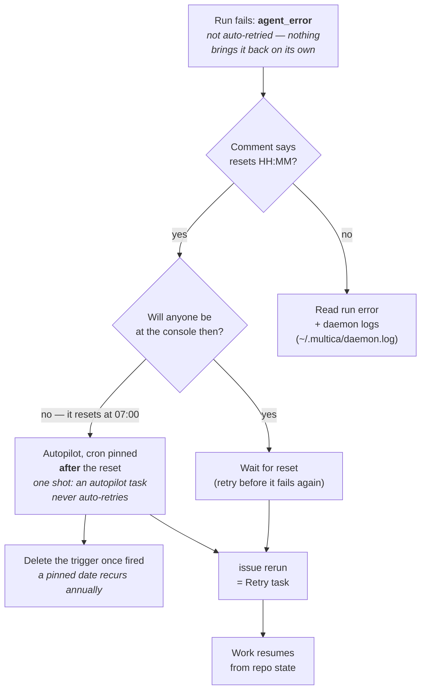

## Getting current — what `/upgrade` actually walks

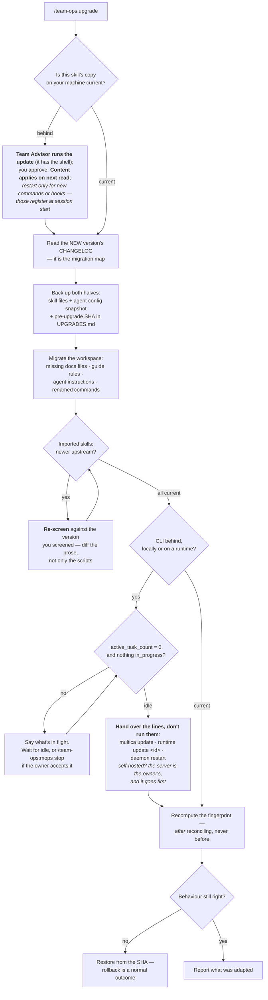

> Two things this picture exists to prevent: **new bytes without a migration** (half the
> company on one version, half on another), and **a CLI replaced under a running agent**,
> which produces failures that look like the agent's fault.

## Something went wrong — whose defect is it?

**The person who just hit it should not have to classify it.** The door decides, from evidence.

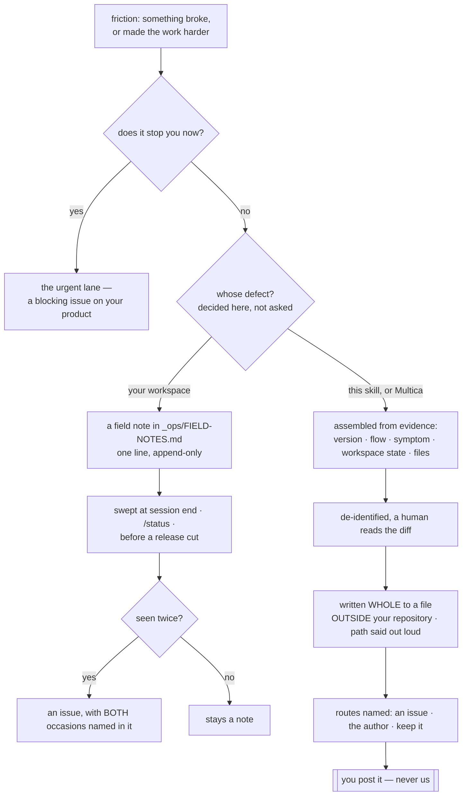

> **`/team-ops:report` is the door**, and a sentence reaches the same place. **The file is
> written before anything is missing** — a field it cannot know is marked `unknown` and the offer
> to fill it comes after, because a missing field is not a reason to withhold the artefact.
> Measured: scenario 23 caught the first version stopping to ask, leaving the report as chat text.

## The skill lifecycle — gates, not ceremony

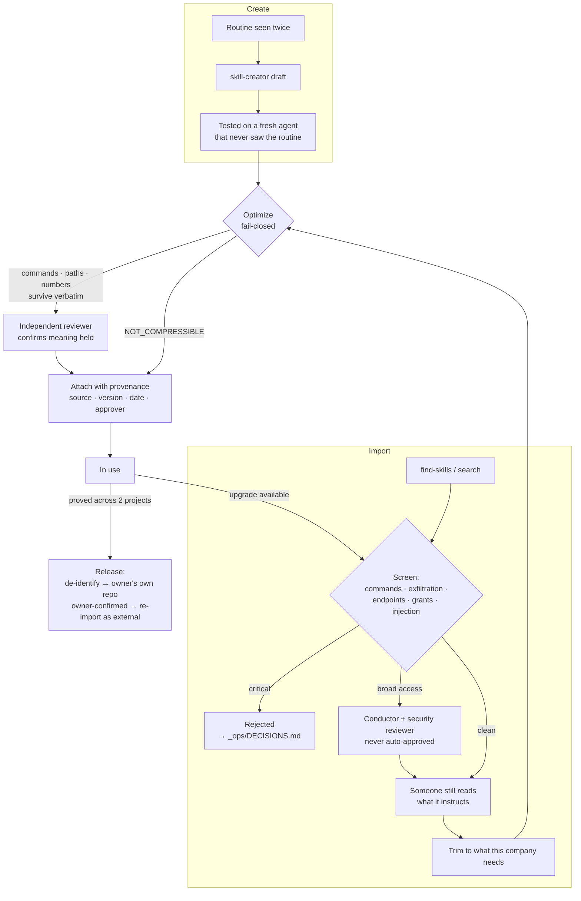

> The loop back to **Screen** on upgrade is the point most setups miss: a version you vetted
> is not the version you are about to install.

## A catch climbs, and a contradiction stops

Two rules that changed how this skill maintains itself, drawn because both are easy to nod at and
hard to follow.

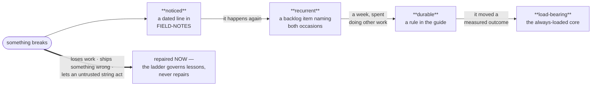

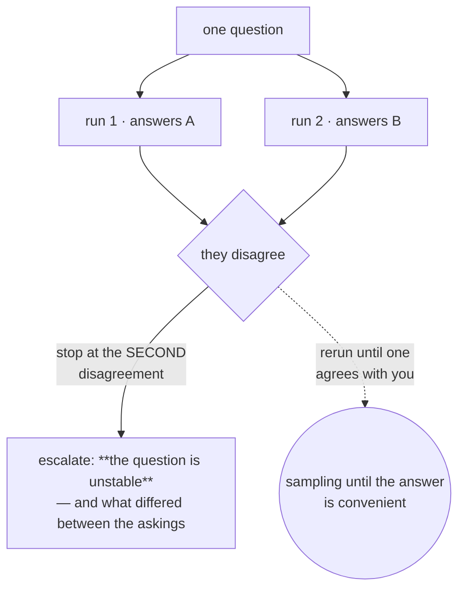

**Three attempts bound failure; the second diagram bounds contradiction** — the worse state,
because every run inside it looks like a success. Both are listed by name in the prose-only table
with the exact reason neither is a gate today: `issue runs` records that a run *finished*, not what
it *concluded*, and nothing compares a promotion's citation against its note's date.
